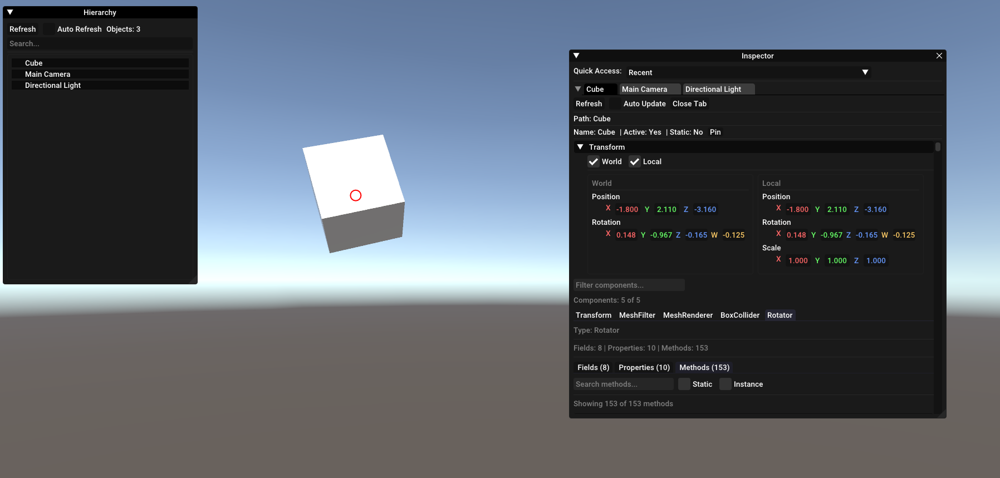

# UnityInspector

A powerful runtime inspector for Unity games with **Mono** and **IL2CPP** support.

  

more screenshots at [Assets](Assets/)

---

## Overview

UnityInspector is a single-DLL runtime inspection tool that allows you to explore and modify Unity games in real-time. Whether you're a game developer debugging your project or a researcher analyzing game mechanics, UnityInspector provides comprehensive access to Unity's internal structures.

### Key Highlights

- **Single DLL injection** - No external dependencies required
- **Dual runtime support** - Works with both Mono and IL2CPP backends
- **Live editing** - Modify object properties in real-time

---

## Features

### Inspector

- **Scene Hierarchy Browser**
  - Complete tree view of all GameObjects in the active scene
  - Shows active/inactive state with visual indicators

- **Component Inspection**
  - View all components attached to any GameObject
  - Component filtering by name
  - Field and Property tabs for organized viewing

- **Field Editor**
  - Edit instance and static fields directly
  - Support for multiple types:
    - Numeric: `int`, `float`, `double`
    - Vectors: `Vector2`, `Vector3`, `Vector4`
    - Rotation: `Quaternion`
    - Color: `Color` with built-in picker
    - Boolean: `bool` with checkbox
    - String: Read-only display

- **Property Editor**
  - Read/Write property access
  - Inline editing with appropriate controls

- **Method Invoker**
  - Invoke methods at runtime with custom parameters
  - Parameter type validation
  - Return value display
  - Static and instance method support

- **Transform Editor**
  - World and Local coordinate views
  - Position, Rotation, Scale editing

---

## Installation

### Requirements

- Windows 10 or later
- Unity game (Mono or IL2CPP) running on **DirectX 11**
- DLL injector (any injector will work)

> **Note:** Only DirectX 11 is supported. DX12 and Vulkan are **not** supported. Launch your game with `-force-d3d11` to ensure DX11 mode.

### Steps

1. Download the latest `UnityInspector.dll` from [Releases](https://github.com/PicoShot/UnityInspectorStandalone/releases)
2. Inject the DLL into your target Unity game process using your preferred injector
3. Press `INSERT` to toggle the menu

---

## Supported Unity Versions

| Version | Mono | IL2CPP |
|---------|------|--------|
| 2015-2020.x  | [?] | [?] |
| 2021.x  | [?] | [!] |
| 2022.x  | [!] | [+] |
| 2023.x  | [?] | [?] |
| 6000.x  | [+] | [+] |

- [?] Not Tested  
- [-] Not Supported
- [!] Have Bugs
- [+] Supported
---

## Credits

- [ImGui](https://github.com/ocornut/imgui) by ocornut
- [Kiero](https://github.com/Rebzzel/kiero) for the DirectX hooking framework

---
